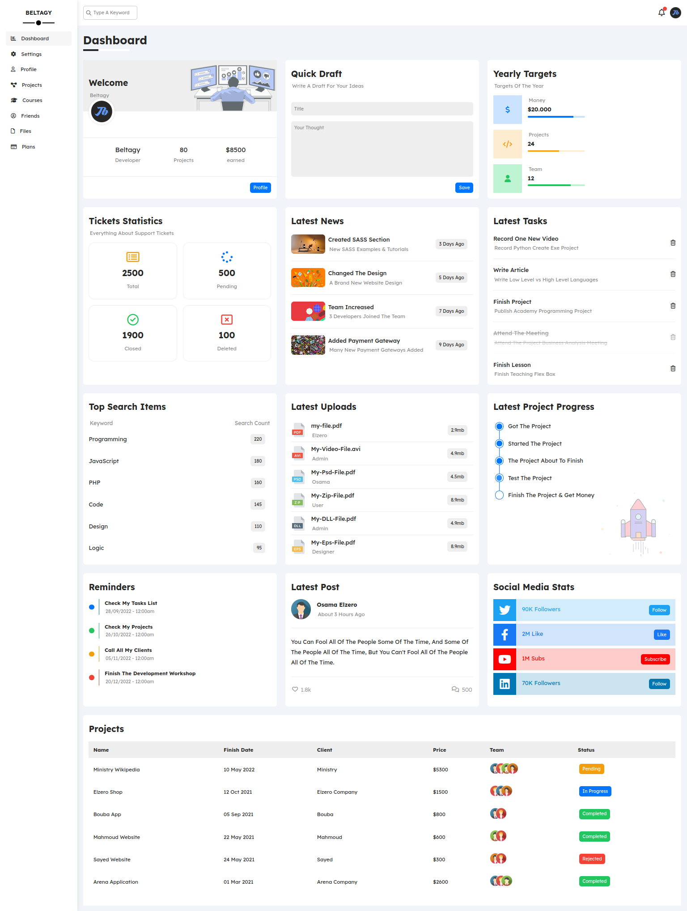

# Dashboard Project using Pug, Sass, JavaScript, and Gulp.js

## Introduction

Hello! My name is Mohammed Beltagy, and I'm excited to share my Dashboard Project with you. I used Pug, Sass, JavaScript, and Gulp.js to create a responsive website with eight pages. Throughout this project, I focused on organizing my workspace and unifying my Sass code to create a consistent design across all pages. I also utilized JavaScript to enhance the user experience and add dynamic functionality to the website. I'm proud of what I've created, and I hope you enjoy exploring my project.

## What's New in this Project

This project is larger than my usual projects, which allowed me to challenge myself and improve my skills. Here are some things I accomplished in this project:

- Organized my workspace effectively to handle a large project
- Improved my skills in Pug, Sass, and Gulp.js
- Utilized Chat-GPT for repetitive processes in projects.js, courses.js, and other JavaScript files
- Unify my Sass code and use the same style for all pages without repeating the code

## What I Learned from this Project

This project was a great learning experience for me. Here are some of the things I learned:

- Improved my skills in Pug, Sass, and JavaScript
- Realized the importance of organizing my workspace to handle larger projects
- Learned how to utilize Chat-GPT to automate repetitive processes
- Realized the benefits of unifying my Sass code to create a consistent design across all pages

## Links

- [Style Link](https://elzerowebschool.github.io/HTML_And_CSS_Template_Four/) - I have rebuilt this website, originally created by Elzero Web School.
- [Live Site](https://mohammed-beltagy.github.io/Dashborad/) - Check out my implementation of the Dashboard Project.
- [Portfolio](https://beltagy.netlify.app) - Discover impressive projects with seamless functionality, and meticulous attention to detail.

Thank you for taking the time to check out my project. If you have any questions or would like to discuss potential opportunities, please feel free to contact me.
